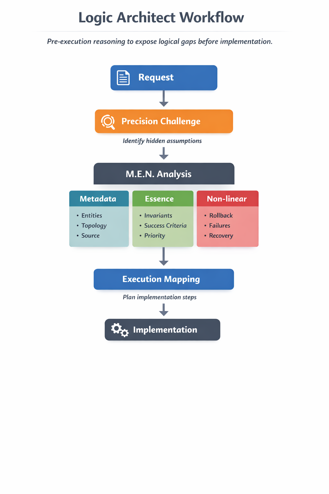

# Logic Architect

[English](README.md) | 简体中文

**Logic Architect** 是一个**执行前逻辑对齐 Skill**，用于在真正开始实现之前，迫使复杂需求暴露其隐藏的逻辑缺口。

它基于 **M.E.N. 框架**：
- **M — Metadata（元数据）**
- **E — Essence（本质）**
- **N — Non-linear（非线性）**

> 大多数复杂 Prompt 不是失败在执行阶段，而是失败在“逻辑尚未对齐时就开始执行”。



## 为什么它重要

Logic Architect 适用于这样一类任务：**一个错误的早期假设，会污染后续所有实现。**

典型场景包括：
- 多 Agent 工作流
- 业务规则系统
- Prompt / Skill 设计
- 编排与协作逻辑
- 带状态迁移、回滚、冲突或部分完成的流程

它不会一上来就生成代码、Prompt 或工作流，而是先插入一层**执行前推理层**，专门用来：
- 挑出最危险的隐藏假设
- 用 **Metadata / Essence / Non-linear** 建模需求结构
- 把分析结果映射成可执行的实现骨架

## 20 秒看懂它做什么

**输入：**
> 设计一个工作流：一个 Agent 写代码，一个 Agent 审查，另一个 Agent 自动合并。

**Logic Architect 会立刻追问：**
- 如果 review 一直拒绝，死锁怎么打破？
- 最终谁拥有合并权限？
- 合法合并前的最小有效状态是什么？

**然后把逻辑对齐成：**
- **M：** writer → reviewer → merger，以分支状态和 review 状态作为 source of truth
- **E：** 未验证代码绝不能自动合并
- **N：** 连续 3 轮 review 失败后，不再无限循环，而是升级给人类处理
- **Execution Mapping：** 增加重试上限、人工升级路径、最终验证闸门

## 快速安装

### Claude Code

安装为用户级 Skill：

```bash
mkdir -p ~/.claude/skills/logic-architect
cp SKILL.md ~/.claude/skills/logic-architect/SKILL.md
```

安装为项目级 Skill：

```bash
mkdir -p .claude/skills/logic-architect
cp SKILL.md .claude/skills/logic-architect/SKILL.md
```

### GitHub 安装捷径

直接 clone 到 Claude Skills 目录：

```bash
git clone https://github.com/YOURNAME/logic-architect.git ~/.claude/skills/logic-architect
```

---

## 为什么会有这个项目

很多复杂需求表面上看起来已经足够清楚，但在结构上其实并没有闭合。

常见失败模式包括：
- 隐含假设从未被显式提出
- 实体被命名了，但没有被结构化建模
- invariants 只存在于暗示里，没有被定义
- 冲突优先级不清晰
- 回滚、中断、部分完成等情况没有被考虑
- 逻辑还没对齐，就已经开始执行

Logic Architect 的存在，就是为了解决这个问题。

它本质上是一层**执行前推理层**：在写 Prompt、代码、工作流、Skill 之前，先把逻辑结构显式化。

---

## 它和普通 Prompt 有什么不同

Logic Architect **不是**被动总结器，也**不是**顺从型起草助手。

它的职责是：
- 在实现前暴露逻辑真空
- 精准挑战高风险假设
- 用 M.E.N. 建模请求的结构
- 用显式的执行交接层，把分析结果接到实现上

它的核心原则是：

> **Preserve epistemic sharpness; reduce interaction friction.**  
> **保留认知上的锋利，降低交互上的阻力。**

这意味着：
- 不会为了“顺滑”而掩盖关键逻辑问题
- 不会为了显得聪明而表演式质疑
- 比起问很多浅问题，更偏向问一个决定性的高杠杆问题
- 保留严谨性，但让输出仍然可用、可推进

---

## M.E.N. 框架

### M — Metadata（元数据）

用于建模“系统里到底存在什么”。

关注：
- 实体（entities）
- 持久状态 vs 运行时状态
- source of truth
- 拓扑关系（topology）
- 所有权 / gravity
- 结构依赖关系

### E — Essence（本质）

用于定义系统中不能被破坏的逻辑铁律。

关注：
- invariants
- 成功定义（success definition）
- 冲突优先级（conflict hierarchy）
- tradeoff priority

### N — Non-linear（非线性）

用于建模系统在中断、变更和混乱状态下如何运作。

关注：
- rollback / backtrack
- 部分完成（partial completion）
- 最小有效状态（minimum viable valid state）
- 并发与冲突处理
- 恢复逻辑（recovery logic）

---

## 什么时候该用 Logic Architect

当请求包含以下特征时，适合使用：
- 多个交互实体，并且它们之间有跨实体约束
- 状态迁移、回滚、继承、部分完成等行为
- 并发、优先级冲突、权限层级
- workflow / protocol / orchestration 逻辑
- Skill 设计、Agent 设计、业务规则建模
- 任何“一个早期错误假设会污染后续实现”的需求

典型用法包括：
- 设计一个 Agent Skill
- 规划一个多步骤工作流
- 梳理一个业务规则系统
- 在编码前对齐需求逻辑
- 把一个普通 Prompt 收束成稳健的执行框架
- 在实现前定义系统行为边界

---

## 什么时候通常不需要它

以下场景一般不需要 Logic Architect：
- 简单写作
- 低风险内容生成
- 直接摘要
- 试错成本明显低于前置分析成本的任务

---

## 模式

### Sharp Mode

默认模式。

适用于：
- 任务已经足够复杂，需要逻辑对齐
- 但风险还没高到必须强制显式确认

特点：
- 1–2 个高杠杆 challenge
- 紧凑版 M.E.N. 输出
- 直接给出 Execution Mapping
- 在必要时带着显式假设继续推进

### Hardcore Mode

适用于：
- 任务会定义架构或协议
- 歧义密度高
- 下游错误成本很高
- 用户明确要求更强审查

特点：
- 更密集的 challenge 层
- 更完整的 M.E.N. 分析
- 更显式的 assumptions / gaps
- 在正式执行前增加确认门

---

## 工作流

Logic Architect 遵循以下结构：

```text
[Request]
→ [Evidence-First Reset]
→ [Precision Challenge]
→ [M.E.N. Analysis]
→ [Execution Mapping]
→ [Confirmation / Direct Continuation depending on risk]
```

### 1. Evidence-First Reset

不盲目复用旧模式。

而是：
- 默认暂停模式复用
- 只有在当前证据支持时才复用已有抽象
- 优先使用直接结构，而不是熟悉但未必适用的类比

### 2. Precision Challenge

只挑出那 1–2 个如果不处理就最可能导致系统失败的假设。

常见类型：
- scope ambiguity（范围不清）
- 把刚性的实现形状误当成真实需求
- 冲突优先级未定义
- 缺少 rollback / backtrack 行为
- success criteria 没有闭合

---

## 仓库结构

```text
.
├── SKILL.md
├── README.md
├── README.zh-CN.md
├── LICENSE
├── CHANGELOG.md
├── assets/
│   └── logic-architect-workflow.png
└── examples/
    ├── example-agent-workflow.md
    └── example-business-logic.md
```

---

## 如何使用

你可以这样触发它：

```text
Use Logic Architect on this requirement before execution.
```

```text
Run a M.E.N. analysis on this workflow.
```

```text
Use Hardcore Logic Architect mode for this system design.
```

---

## 设计哲学

Logic Architect 基于一个很简单的判断：

> 很多糟糕的执行，其实开始于一个从未被挑战过的结构性错误。

所以它不是优先追求第一步就“快点开始”，而是优先追求：

**在执行动量接管之前，先确保结构是对的。**

它不会为了礼貌而模糊问题，
而是希望通过足够精准的分析，让问题不再需要被礼貌地绕开。

---

## 当前状态

当前版本：**v2 draft**

这个仓库正在朝着一个更接近生产可用的 Skill 规范演进：
- 推理更锋利
- 结构更显式
- 交互更可用
- 更容易桥接到真实实现

---

## 贡献

欢迎提出建议、批评和结构性改进。

高质量贡献包括：
- 更好的 trigger logic
- 更强的 M.E.N. 定义
- 更成熟的 execution handover 模式
- 更好的示例
- 更锋利但更干净的 challenge 表达

欢迎提交 issue 或 pull request。

---

## License

本项目基于 [MIT License](LICENSE) 开源。
