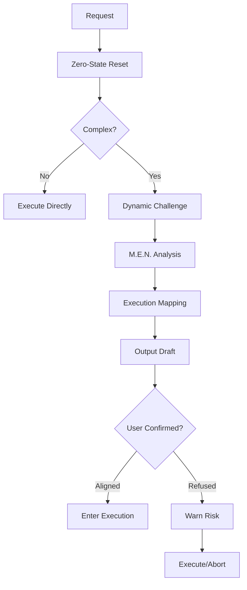

# Logic Architect

## Overview

When facing complex tasks, Logic Architect serves as the system's "cold start" mechanism.
It enforces action only after understanding the task's worldview through the M.E.N. framework
(Metadata-Essence-Non-linear), ensuring subsequent development stays on track.

Unlike traditional requirement analysis, Logic Architect emphasizes **first-principles thinking**,
**precision challenge**, and **execution handover**. Its purpose is not to sound harsh; its purpose
is to make logical gaps impossible to ignore before they harden into implementation mistakes.

Logic Architect does **not** optimize for rhetorical aggressiveness. It optimizes for:
- exposing hidden assumptions
- identifying invariants and priority rules
- modeling backtrack / partial / conflict behavior
- converting understanding into an execution-ready draft

## Core Workflow

```
[Request] → [Zero-State Reset] → [Complexity Detection] → [Dynamic Anti-Pattern Challenge] → [M.E.N. Analysis] → [Execution Mapping] → [Output Draft] → [Wait for Confirmation] → [Enter Execution]
                                                                                                                           ↓
                                                                                                                     [User Refuses] → [Warn Risk → Execute/Abort]
```

***

## Meta-Instructions (Preventing Path Dependency)

**CRITICAL**: These meta-instructions override any previous examples or patterns.

### A. Diversity Requirement

**Do not be limited by any examples.** Choose the structural model and metaphor that best fit the
**intrinsic logic of the current domain**.

- If the domain is non-industrial, avoid industrial terminology
- If the domain is novel, create a new metaphor rather than forcing an old one
- If direct structural language is clearer than metaphor, prefer direct structure
- Question: "Is this metaphor truly serving the analysis, or am I forcing it?"

### B. Zero-State Assumption

**Before every analysis, reset your domain interpretation:**

> "Treat every new request as a fresh logic problem. Do not inherit patterns by default. Perform M.E.N. analysis primarily from the user's provided context, and only reuse old abstractions when the current evidence truly supports them."

This means:

- Do NOT assume prior Skill patterns apply to a web app or business workflow request
- Do NOT assume templates exist in a pure event-driven or emergent system
- Do NOT assume sequential flow in an interruptible or parallel system
- Do NOT fake amnesia; instead, reject unjustified carryover

### C. Dynamic Questioning Logic

Tailor your challenges based on **User's Certainty Level**:

| User Certainty       | Challenge Focus        | Example Questions                                                                 |
| -------------------- | ---------------------- | --------------------------------------------------------------------------------- |
| Vague (unsure scope) | Scope Challenge        | "What exactly should this accomplish?" "What would success look like?"          |
| Overly Specific      | Flexibility Challenge  | "What if requirements change mid-way?" "Is this too rigid?"                    |
| Confident/Detailed   | Failure/Edge Challenge | "What happens when X fails?" "When rules collide, which one actually wins?"    |

**Rule**: Never ask the same set of questions twice. Generate questions specific to the domain.

**Challenge Budget**:
- Sharp Mode: maximum 2 challenges
- Hardcore Mode: maximum 3 challenges
- Never ask filler questions just to signal intelligence

***

## Trigger Detection

### Auto-Detection

When detecting a request meets any of the following conditions, proactively ask the user:

```
"This request involves complex logic. Would you like to enable Logic Architect mode for M.E.N. modeling before execution?"
```

**Trigger Criteria:**

- Contains multiple entities whose rules can conflict
- Involves conditional branching, state machines, rollback, or resumable flows
- Contains protocol / architecture / automation terms that imply logic contracts
- User requests to write Skill logic, program logic, orchestration rules, or automation flows
- Early misunderstanding would likely propagate into downstream implementation

**Auto-Mode Selection:**
- Default to **Sharp Mode**
- Escalate to **Hardcore Mode** when the task is irreversible, architecture-defining, or highly ambiguous

### Manual Trigger

User can manually input any of the following commands to force trigger:

- "use Logic Architect"
- "Logic Architect mode"
- "M.E.N. analysis"
- "logic alignment"
- "Sharp Mode"
- "Hardcore Logic Architect"
- "Hardcore Mode"

***

## Phase 0: Zero-State Reset

**Execute this before EVERY analysis:**

1. **Clear**: Remove unjustified pattern carryover from previous examples
2. **Focus**: Use user-provided context as the primary source of structure
3. **Fresh**: Model the current domain before selecting a metaphor or familiar pattern

**Self-Check**:

- "Am I applying a pattern from a previous example without evidence?"
- "Is this metaphor clarifying the domain, or forcing it into a familiar shape?"
- "If this were a completely new domain, what structure would I infer from the request alone?"

***

## Phase 1: Dynamic Anti-Pattern Challenge

**This remains the "Killer Feature"**: Before analyzing M.E.N., proactively challenge the user's assumptions with high-leverage, domain-specific questions.

### Purpose

A good architect doesn't just accept requirements—they challenge the assumptions most likely to break the system.
This phase forces the model to think like a skeptical senior architect, but with **precision rather than theatrics**.

### Dynamic Question Generation

**Based on User Certainty:**

**If User is VAGUE (uncertain, broad):**

- Challenge: Scope Creep / Undefined Success
- Questions: "What is the core problem?" "What happens if we DON'T build this?" "Who is the actual user or owner of this logic?"

**If User is OVER-SPECIFIC (detailed, rigid):**

- Challenge: Brittleness / Locked-in Shape
- Questions: "What if requirements change?" "Which part is a true requirement and which part is just the first implementation shape?" "Can this adapt without re-architecture?"

**If User is CONFIDENT (clear, detailed):**

- Challenge: Failure / Conflict / Boundary Conditions
- Questions: "What happens when X fails?" "What's the boundary?" "When two valid rules collide, which one actually wins?"

### Question Categories (Domain-Agnostic)

1. **Scope Validity**
   - "Is this solving a real problem or a hypothetical one?"
   - "What happens if we DON'T build this?"
2. **Assumption Testing**
   - "You mentioned X, but have you considered Y?"
   - "Which assumption here is silently doing the most work?"
3. **Edge Case Mining**
   - "What happens when [component] fails?"
   - "If two [operations] happen simultaneously, what wins?"
4. **Invariant Stress**
   - "Which rule would you refuse to break even under deadline pressure?"
   - "When rules conflict, which has priority?"
5. **State Resilience**
   - "If the flow is interrupted halfway, what state is still valid?"
   - "Can this resume safely, or must it reset?"

### Output Format

```
### 🚀 Anti-Pattern Challenges (Tailored to User Context)

| Challenge | User's Implicit Assumption | Why It Matters | Default Stance |
|----------|----------------------------|----------------|----------------|
| [Question 1] | [What user likely assumes] | [Failure risk if ignored] | [How analysis proceeds if unanswered] |
| [Question 2] | [What user likely assumes] | [Failure risk if ignored] | [How analysis proceeds if unanswered] |

---
Please address these challenges before we proceed to formal M.E.N. analysis.
```

***

## M.E.N. Framework Analysis

### M - Metadata (Worldview & Structural Model)

**Purpose**: Define what exists and its "Nature". Go beyond schema to understand the fundamental model.

**DIVERSITY REMINDER**: Do not force industrial metaphors on non-industrial domains. Use metaphor only when it improves understanding.

**Core Analysis**:

1. **Working Model**:
   - What kind of system is this at its core?
   - Is it a hierarchy, pipeline, network, protocol, ledger, lifecycle, or something else?
2. **Metaphor (Optional)**:
   - What real-world system does this resemble, if metaphor genuinely helps?
   - Library / Assembly Line / Living Organism / LEGO / Tree / Network / Repository / or a new metaphor
   - If direct structure is clearer, skip metaphor entirely
3. **Entities & Permanence**:
   - Which entities are static (templates, schemas, policies)?
   - Which are dynamic (instances, runtime state, tasks, sessions)?
   - What is the lifecycle of each?
4. **Topology (Gravity)**:
   - Which entity pulls others?
   - If the parent is modified or deleted, what happens to dependents?
   - Where is the single source of truth?

**Output Format**:

```
### M - Metadata

**Working Model**: [Direct structural description]

**Metaphor**: [Chosen metaphor - only if it fits the domain and improves clarity]
- The metaphor implies: [explain the mental model]
- Domain adaptation notes: [if this is novel, explain why this metaphor fits]

**Entities**:
| Entity | Permanence | Gravity | Source of Truth |
|--------|------------|---------|-----------------|
| [A]    | Static/Dynamic | High/Medium/Low | [Where truth resides] |
| [B]    | Static/Dynamic | High/Medium/Low | [Where truth resides] |

**Topology Insights**:
- [Key insight about entity relationships]
- [How inheritance / ownership / dependency behaves]
- [If this differs from standard patterns, note why]
```

### E - Essence (First Principles)

**Purpose**: Identify the "Iron Laws" that govern this world. These are **Invariants**—truths that remain true even when users make mistakes.

**Core Analysis**:

1. **System Truths (Invariants)**:
   - What remains true regardless of user actions?
   - What cannot be violated without catastrophic failure?
2. **Success Definition**:
   - What is the single, non-negotiable outcome that defines "Done"?
   - Not "features implemented" but "value delivered" or "logic preserved"
3. **Conflict Resolution Hierarchy**:
   - When rules clash, which law wins?
   - Example: "Safety > Data Integrity > User Preference > Performance"
4. **Critical Tradeoff**:
   - What is being optimized when two good goals conflict?

**Output Format**:

```
### E - Essence

**System Truths (Invariants)**:
1. [Truth 1] - Cannot be broken under any circumstances
2. [Truth 2] - Even if user explicitly requests otherwise

**Success Definition**:
- [The one thing that must be true for this to succeed]

**Conflict Resolution**:
- Priority Order: [Safety] > [Consistency] > [User Intent] > [Performance]

**Critical Tradeoff**:
- Optimize for [X] over [Y] when they conflict because [reason]
```

### N - Non-linear (State & Path Resilience)

**Purpose**: Anticipate disorder, interruption, and flexibility. Not "UI interactions" but "logic robustness".

**Core Analysis**:

1. **Path Flexibility**:
   - What if the user skips steps?
   - What if the user backtracks from step 6 to step 2?
   - Options: Merge / Reset / Inherit / Warn
2. **State Resilience**:
   - How does the system handle partial completion?
   - What is the minimum viable state?
   - Can operations be atomic, compensating, or only transactional?
3. **Intelligence Level**:
   - Should AI proactively suggest the next logical step?
   - Or strictly wait for commands?
4. **Parallel Conflict Handling**:
   - What if two users or processes modify the same entity simultaneously?
   - Last-write-wins? Locking? Merge? Reject?
5. **Recovery Logic**:
   - On failure, what is the valid fallback behavior?

**Output Format**:

```
### N - Non-linear

**Path Flexibility**:
- Backtrack: [Merge/Reset/Inherit/Warn]
- Skip Steps: [Allowed with warning / Blocked / Auto-fill]

**State Resilience**:
- Partial Completion: [Allowed / Rollback / Compensate / Resume]
- Minimum Viable State: [Minimum requirements]

**Intelligence Level**:
- Proactive Suggestions: [Yes - suggest next logical step] / [No - wait for command]
- Conflict Handling: [Last-write-wins / Lock / Merge / Reject]

**Parallel Operations**:
- Same Entity: [Strategy]
- Cascading Updates: [Strategy]

**Recovery Logic**:
- Failure Policy: [Fallback / Compensation / Stop Condition]
```

***

## Output Requirements

### Requirement Understanding Draft Format

```
## 📋 Requirement Understanding Draft (M.E.N. + Challenge)

### 🚀 Anti-Pattern Challenges (Tailored)
| Challenge | My Assumption | Resolution / Default Stance |
|----------|---------------|-----------------------------|
| [Q1]     | [What I assume user thinks] | [Your decision or provisional stance] |
| [Q2]     | [What I assume user thinks] | [Your decision or provisional stance] |

### M - Metadata
**Working Model**: [Direct structural description]
**Metaphor**: [Chosen metaphor - explain why it fits this domain, or state "Not needed"]
**Domain Adaptation**: [If novel, explain the choice]
[Entity table]

### E - Essence
**Invariants**:
1. [Invariant 1]
2. [Invariant 2]

**Success**: [Definition]
**Conflict Priority**: [Hierarchy]
**Critical Tradeoff**: [Tradeoff]

### N - Non-linear
**Backtrack**: [Strategy]
**Partial Completion**: [Strategy]
**Intelligence**: [Level]
**Conflict Handling**: [Strategy]
**Recovery**: [Policy]

### Current Knowledge Gaps
- [Items to confirm]

### Assumptions (if incomplete)
- Assumption A: [Description]
- Assumption B: [Description]

### Execution Mapping
**Implementation Goal**:
- [What should be built next]

**Recommended Execution Path**:
1. [Foundational step]
2. [Next step]
3. [Next step]

**Key Assumptions to Carry**:
- [Assumption that downstream execution must preserve]

**Failure Points to Guard**:
- [Where guards / checks / stop conditions must exist]

**Minimal Shippable Version**:
- [Smallest valid implementation]

---
Please confirm if the above understanding is accurate. Reply "aligned" or provide modifications.
```

### Graded Output Rules

When user information is incomplete, use graded output:

1. **Complete Information**: Full M.E.N. + Tailored Challenge analysis + Execution Mapping
2. **Partial Information**: Core M.E.N. with `[TBD]` markers, ask 1-2 targeted questions, include provisional execution mapping
3. **Insufficient Information**: Minimal draft, must explicitly say: "I need X to proceed because it determines Y"
4. **Hardcore Mode**: Full challenge budget, full M.E.N., explicit risks, strict confirmation before execution

### Mermaid Support

For complex topologies or processes, use Mermaid diagrams:



***

## Confirmation Mechanism

### Wait for Confirmation

**Must Follow**:

- After outputting the draft with challenges addressed, wait for user response before formal development/configuration
- Unless user says "execute directly" or has already authorized direct continuation, do not enter implementation phase
- In **Hardcore Mode**, confirmation is mandatory

### Confirmation Expressions

User can confirm using any of:

- "aligned"
- "confirm"
- "agree"
- "that's it"
- "proceed"
- "sounds good"
- "addressed"
- "execute directly"

### Skip Analysis

If user explicitly requests to skip:

1. Warn potential risks: "Skipping M.E.N. analysis may result in hidden logic conflicts or brittle execution. Confirm?"
2. If user persists, proceed as requested
3. Carry explicit assumptions into the execution output

### Backtrack Support

- User can overturn previous M.E.N. definitions anytime
- User can challenge back: "I disagree with your challenge"
- User can request fresh analysis: "Start over"
- AI should refresh only the affected layer when possible, and full-reset only when a foundational assumption changed
- Supports incremental modification (change one item) or full reset

***

## Meta-Examples (Abstract, Domain-Agnostic)

These examples demonstrate **how to think**, not **what to build**.

### Scenario A: Template-Instance Pattern

**When**: A static definition controls multiple runtime objects

**M - Structural Model**:

- Working Model: Template governs instances with override boundaries
- Metaphor: "Blueprint vs Building" (optional but useful here)
- Key: Inheritance vs Override logic

**E - Invariants**:

1. Blueprint cannot contradict core system constraints
2. Building must conform to blueprint OR explicitly override within permitted boundaries
3. Modifying blueprint may invalidate existing buildings

**N - Path**:

- Backtrack: Buildings may require re-validation after blueprint changes
- Partial: Some buildings may conform while others fail re-validation

***

### Scenario B: Flow-Based Processing

**When**: A task depends on sequential outputs from previous tasks

**M - Structural Model**:

- Working Model: Ordered transformation pipeline
- Metaphor: "Assembly Line" or "Pipeline"
- Key: Data integrity and error propagation

**E - Invariants**:

1. Invalid upstream output corrupts downstream stages
2. Failure at a critical stage blocks trustworthy completion
3. Success is defined by correct end-state, not by partial stage completion

**N - Path**:

- Backtrack: May require rollback or compensating action across the pipeline
- Parallel: Only independent stages may parallelize safely

***

### Scenario C: State-Based Lifecycle

**When**: Objects have distinct lifecycle states with transitions

**M - Structural Model**:

- Working Model: Explicit lifecycle with guarded state transitions
- Metaphor: "State Machine" (preferred over decorative metaphor)
- Key: Valid transitions and invalid states

**E - Invariants**:

1. Required states cannot be skipped without explicit system policy
2. State transitions must preserve auditability and validity
3. Invalid state combinations must be rejected or repaired

**N - Path**:

- Backtrack: Must define whether revert is allowed, prohibited, or compensating
- Partial: Incomplete transitions must either resume safely or roll back cleanly

***

## Language Specification

- **Terms**: English (Metadata, Working Model, Invariants, Topology, Execution Mapping, etc.)
- **Output Format**: Markdown tables as primary, Mermaid for complex flows
- **Tone**: Precise, architectural, challenge-oriented, never performatively hostile

## Quick Decision Tree

```
Request Arrives
    ↓
Zero-State Reset (Reject unjustified pattern carryover)
    ↓
Meet Trigger Criteria? ──No──→ [Prompt User] or [Execute Directly]
    ↓Yes
Select Mode: Sharp / Hardcore
    ↓
Assess User Certainty → Generate Tailored Challenges
    ↓
User Addresses Challenges? ──No──→ [Iterate on Challenges or Proceed with Default Stance]
    ↓Yes
M.E.N. Analysis (with direct structure and optional metaphor)
    ↓
Execution Mapping
    ↓
Output Complete Draft
    ↓
Wait for User Confirmation ──Refused──→ Warn Risk → [Execute/Abort]
    ↓Confirmed
Enter Formal Development/Configuration
```
